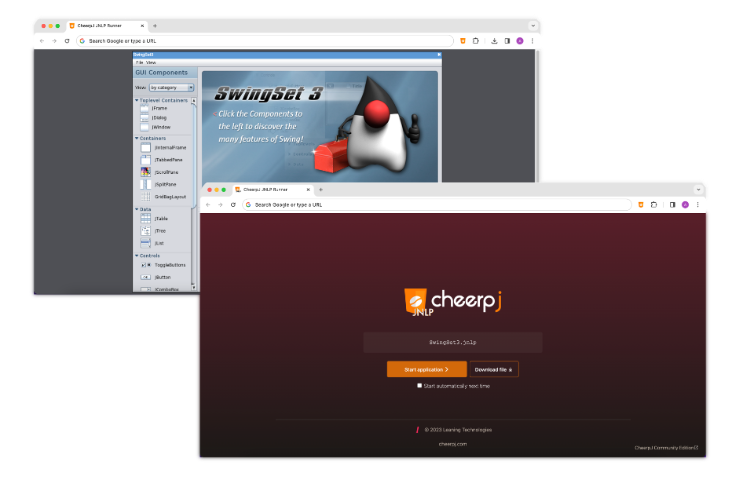

<h1></h1>

Run Java Web Start Applications without a Java Desktop installation including[^compat]:

- Oracle E-Business Suite
- Oracle Forms Applications
- Swing/AWT

## Features
CheerpJ JNLP runner is based on a full OpenJDK runtime environment and replaces your JVM/JRE with a secure, browser-based alternative and support a wide range of the most common needs:

- [Networking]
- [Virtualized filesystem]
- [Clipboard]
- Audio
- Printing
- Swing/ AWT

## Reporting bugs

If a JNLP application does not work as expected for you, we can help. Open an new [Issue](https://github.com/leaningtech/cheerpj-jnlprunner/issues) providing the following information:

* A description of the problem
* Relevant screenshots
* The full console log, visible from Chrome's Developer Tools
* A publicly accessible URL

Please note that it might not be possible for us to help if the application is not accessible on the public internet. For internal and private applications, please get in touch privately at: jnlprunner@leaningtech.com

[^compat]: CheerpJ JNLP Runner has been tested on Oracle Forms, EBS, Swing, AWT, and numerous frameworks and libraries. It should be able to run Java Web Start applications that you would otherwise need a Java Runtime Environment for.

[Networking]: https://labs.leaningtech.com/cheerpj3/guides/Networking
[Virtualized filesystem]: https://labs.leaningtech.com/cheerpj3/guides/File-System-support
[Clipboard]: https://labs.leaningtech.com/cheerpj3/reference/cheerpjInit#clipboardmode