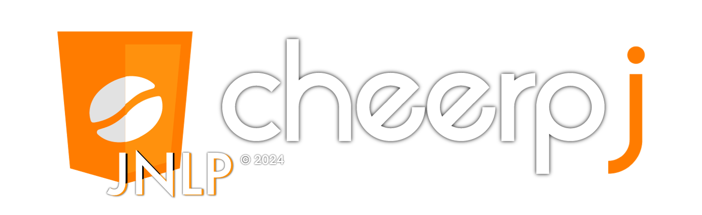

<h1></h1>

Run Java Web Start Applications without a Java Desktop installation including[^compat]:

- Oracle E-Business Suite
- Oracle Forms Applications
- Swing/AWT

The CheerpJ JNLP Runner browser extension, available for Chrome and Edge, can run Java Web Start (JWS) applications without a local Java Desktop installation. This browser extension, based on the [CheerpJ](https://github.com/leaningtech/cheerpj-meta) technology, is designed to replace the local Java Desktop installation, and run Java Web Start applications within the browser, without Java.

The extension is private and secure, runs fully client-side (i.e. it does not contact any server), and does not collect any data or analytics at all. All your data, as well as your application are kept within the boundaries of your browser.

## Features
CheerpJ JNLP Runner is based on CheerpJ, a JVM/JRE in WebAssembly and JavaScript for modern browsers. CheerpJ comes with a full OpenJDK runtime environment and replaces your JVM/JRE with a secure, browser-based alternative to run Java applications. 

CheerpJ supports a wide range of common application requirements, including:

- [Networking], including HTTP/S and TCP
- [Virtualized filesystem]
- [Clipboard] access
- Audio
- Printing
- Swing/AWT

## How to use the CheerpJ JNLP Runner

The extension is designed to be simple and easy to use. Once installed, navigate to the website hosting the JNLP file, and the JNLP Runner extension will automatically activate. A new Chrome tab will open, and after agreeing to the license, you'll see the options 'Start Application' and 'Download'. Simply click on 'Start Application', and the Java application will be executed within the browser.

## Privacy and Security

The extension is private and secure, runs fully client-side, and does not collect any data or analytics at all. All your data, as well as your application are kept within the boundaries of your browser. The privacy policy for the CheerpJ JNLP Runner is available [here](https://cheerpj.com/privacy-policy-for-cheerpj-jnlp-runner-chrome-extension). 

## Reporting bugs

If a JNLP application does not work as expected for you, we can help. Open an new [Issue](https://github.com/leaningtech/cheerpj-jnlprunner/issues) providing the following information:

* A description of the problem
* Relevant screenshots
* The full console log, visible from Chrome's Developer Tools
* A publicly accessible URL

Please note that it might not be possible for us to help if the application is not accessible on the public internet. For internal and private applications, please get in touch privately at: jnlprunner@leaningtech.com

[^compat]: CheerpJ JNLP Runner has been tested on Oracle Forms, EBS, Swing, AWT, and numerous frameworks and libraries. It should be able to run Java Web Start applications that you would otherwise need a Java Runtime Environment for.

[Networking]: https://labs.leaningtech.com/cheerpj3/guides/Networking
[Virtualized filesystem]: https://labs.leaningtech.com/cheerpj3/guides/File-System-support
[Clipboard]: https://labs.leaningtech.com/cheerpj3/reference/cheerpjInit#clipboardmode
